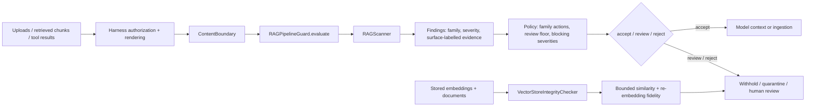

# ragguard — architecture one-pager

**Purpose:** explainable, local security triage for untrusted documents and tool
results before they enter an agent's context. A clean scan is not proof of safety.

**Core:** the scanner prepares each text once into canonical, deobfuscated
(look-alikes, letter spacing, leetspeak), raw and bounded base64/hex-decoded
surfaces, matches 19 named families, walks metadata fields, and returns frozen
findings with redacted, surface-labelled evidence. `scan_chunks()` also catches
injections split across adjacent chunk boundaries. Base install is standard-library
only; numpy is an optional extra for vector checks.

**Policy:** one immutable policy serves typed (`evaluate`, `evaluate_batch`) and
dictionary (`ingest`, `batch_ingest`) callers. Findings below the review floor
(medium by default) are advisory — reported, listed in `advisory_families`, but
accepted. Monitoring reports findings without rejecting; enforcement rejects
critical/high. `ContentBoundary` releases text only after policy allows it,
holding review by default. Errors and oversized inputs never release text.

**Contracts:** reports carry `schema_version` 1.1 and `ruleset_version`; JSON
Schemas for reports and the worker protocol ship with the package
(`load_schema`). The worker's ready handshake announces ruleset, schema and
package versions, and clients fail closed on drift.

**Vector assessment:** a separate, caller-invoked API. Cosine-high/text-low pairs
and cross-user proximity are medium heuristics; re-embedding with the same model
(`assess_embedding_fidelity`) is the high-confidence tampering signal. None of
these establish tenant isolation; test retrieval against real entitlements.

**Harness integration:** wrap an OpenAI function tool; intercept LangChain tool
results or a LangGraph retrieval node; postprocess LlamaIndex nodes; check inside
CrewAI tools or Google ADK callbacks; guard an MCP retrieval server. These are
designs; the framework-neutral adapter, local example and DeepSeek bundle are tested.

**Trust boundary:** authorize before retrieval, scan the exact rendered text before
prompt assembly, and keep held content out of history, memory and streams. Scanning
a result cannot undo a tool's side effects. The host owns ACLs, credentials,
approvals, sandboxing, egress and output validation.

**Measured, not assumed:** `evals/` runs a synthetic corpus in CI. Ruleset
2026.10.1 flags 35% of attacks at a 5.1% benign false-positive rate; paraphrased,
multilingual and task-phrased exfiltration attacks are at 0%. Calibrate per-family
policy on your own corpus before enabling automatic rejection.

**Design tradeoff:** small deterministic rules are cheap (sub-millisecond p95) and
auditable, but miss novel phrasing and can flag benign technical material. A
model-based detector tier, a data-driven rule pack and chunk-aware pipeline entry
points are roadmap items.

See [integration recipes](HARNESS_INTEGRATIONS.md), the
[full architecture](ARCHITECTURE.md) and the [evaluation corpus](../evals/README.md).

### Implemented DeepSeek adapter

The [DeepSeek bundle](../integrations/deepseek/README.md) attaches to
`tools/post-execute` and sends bounded result projections to a persistent
`python -m ragguard.worker` over private JSON Lines. The TypeScript client checks
the versioned handshake, fails closed on version drift, correlates concurrent requests and retires
failed processes; every error withholds the result. It targets the pinned
0.1.7-rc.2 tools API; tool finalizers and trusted middleware remain outside it.

### Proposed ingestion and retrieval extension

The [RAG ingestion and retrieval proposal](proposals/rag-ingestion-retrieval.md)
adds parsing, parent/child chunks, hybrid retrieval and evidence assembly around
the guard. It is a proposal, not a shipped retriever.
