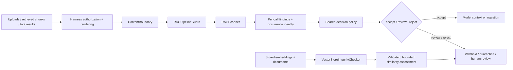

# ragguard — architecture one-pager

**Purpose:** explainable, local security triage for untrusted documents and tool
results before they enter an agent's context. A clean scan is not proof of safety.

**Core:** the scanner canonicalizes text, matches named raw/canonical families,
walks metadata fields, and returns findings with redacted evidence, family,
severity and location. State belongs to each scan. Full-text fingerprints identify
content; input occurrence indices correlate findings without merging equal text.

**Policy:** the pipeline applies the same configurable decision policy to single
and batch ingestion. Monitoring reports findings without rejecting them;
enforcement rejects configured risks. `ContentBoundary.require()` and
`arequire()` release text only after policy allows it, holding review by default.
Scanner errors and oversized inputs propagate instead of releasing unchecked text.

**Vector assessment:** a separate, caller-invoked API validates embeddings,
bounds comparisons and reports coverage and document pairs. Similarity is an
anomaly signal, not proof of poisoning or tenant leakage. Retrieval authorization
must be tested against actual identities, entitlements and returned documents.

**Harness integration:** wrap an OpenAI function tool; intercept LangChain tool
results or a LangGraph retrieval node; postprocess LlamaIndex nodes; check inside
CrewAI custom tools or Google ADK callbacks; guard the server implementation of
an MCP retrieval tool for Codex/Claude. These are integration designs; only the
framework-neutral adapter and local example are executed by this repository's tests.

**Trust boundary:** authorize access before retrieval/return, scan the exact
rendered text before prompt assembly, and prevent held content from entering
history, memory or streaming output. Tool argument authorization must happen
before side effects; scanning a result cannot undo execution. The host owns ACLs,
credentials, approvals, sandboxing, egress restrictions and output validation.

**Operational contract:** log decision, boundary, rule/report version, families
and caller-owned correlation IDs; avoid logging document text or credentials.
Budget document sizes and vector workloads. Roll out with representative benign
and attack corpora; calibrate per-family policy before enabling automatic rejection.

**Design tradeoff:** small deterministic rules are cheap and auditable, but miss
novel phrasing and can flag benign technical material. Native adapters, measured
precision/recall, real entitlement probes and production load testing remain
deployment-specific follow-on work.

See [integration recipes and official sources](HARNESS_INTEGRATIONS.md),
[implementation plan](IMPROVEMENT_PLAN.md), and [full architecture](ARCHITECTURE.md).

### Implemented DeepSeek adapter

The [DeepSeek bundle](../integrations/deepseek/README.md) attaches to
`tools/post-execute` and sends bounded extracted result projections to
`python -m ragguard.worker` over private JSON Lines. A persistent worker keeps
Python startup off the steady-state path. The TypeScript client correlates
concurrent requests and retires failed processes; errors withhold results.
Native block decisions remove canonical values as well as rendered content.
This adapter targets the pinned 0.1.7-rc.2 tools API. Post-hook tool finalizers
and trusted middleware remain outside its enforcement boundary.

### Proposed ingestion and retrieval extension

The [local RAG plan](RAG_INGESTION_RETRIEVAL_PLAN.md) adds mixed-document parsing,
structural child/parent chunks, hybrid retrieval, reranking and evidence assembly
around the existing guard. It is a researched proposal, not a shipped retriever.
