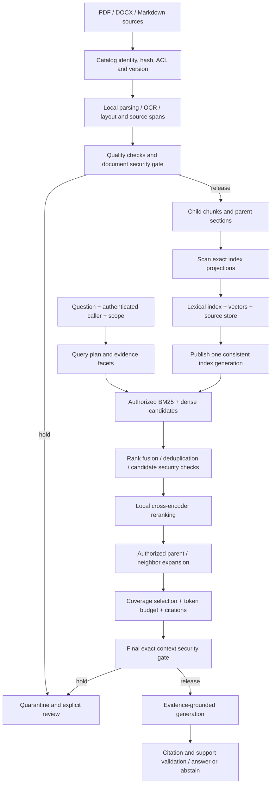

# Local RAG ingestion and evidence retrieval plan

Status: researched design, not an implemented retrieval system. Prepared 2026-09-27.
Scope confirmed by the user: mixed PDFs, Word files and Markdown; local-first
prototype; replaceable parsing, embedding, ranking, search and generation providers.

## Recommendation

Build a separate optional retrieval package around ragguard's existing security
boundary. Start with structure-aware child chunks, a parent-section store, hybrid
keyword/vector search, a local reranker and evidence-based context assembly.
Keep original source spans and citations throughout. Measure whether the final
context contains all required evidence, rather than assuming the top few similar
chunks are sufficient.

There is no universal configuration that guarantees complete, accurate retrieval.
The operational goal is measurable evidence coverage, explicit missing evidence,
correct source/version attribution and an answer that abstains when support is
insufficient. Security acceptance and factual correctness are separate checks.

## What exists and what must be built

Existing components: `Document`, `RAGScanner`, `RAGPipelineGuard`, `ContentBoundary`,
the JSONL worker and the DeepSeek post-tool policy. They inspect supplied content;
they do not parse files, create embeddings, maintain an index, retrieve evidence
or determine whether an answer is factually supported. `RAGPipelineGuard.ingest`
is currently a scan/decision API, despite its name. Vector integrity assessment is
an offline diagnostic, not a retrieval or authorization engine.

New components: source catalog, parser adapters, chunk planner, embedding adapter,
index publisher, query planner, hybrid retriever, reranker, context assembler,
citation validator and evaluation harness. Preserve the core package's small
runtime dependency set by placing these in an optional `ragguard_rag` companion
package or extra. The proposed names in this document are not current APIs.

## End-to-end architecture



Ingestion prepares the evidence; retrieval selects it; prompt assembly presents
it; generation explains it. No step may silently discard a parsing failure,
missing page, expired permission or incomplete evidence requirement.

## 1. Ingest and preserve trustworthy source identity

1. Discover files through an explicit source root or connector. Record the source
   locator, content hash, observed timestamp and connector-owned access metadata.
   Do not take tenant, authority or ACL labels from text inside a document.
2. Keep original bytes in an immutable local artifact store. Track logical document
   identity separately from revision identity. An edit produces a new revision;
   rename handling belongs to the source connector.
3. Parse locally into a document tree: title, headings, paragraphs, lists, tables,
   captions, notes and ordered blocks. Retain normalized-text offsets plus the
   mapping to original page/region/block locations. Page citations are meaningful
   for PDF; DOCX/Markdown should use heading and block anchors unless a stable
   rendering supplies page numbers.
4. Validate extraction: missing/empty pages, suspicious reading order, OCR quality,
   orphan headings, lost tables and unsupported objects. Hold low-quality sources
   for correction; never label a partially parsed file fully indexed.
5. Run the ingestion security gate on parsed content and relevant metadata before
   optional model enrichment or indexing. Keep originals for review. Oversized
   input must be held or processed under an explicitly tested bounded scan policy;
   splitting it silently does not constitute a full-document scan.
6. Publish chunk, lexical and vector data as one versioned generation. Queries pin
   a generation; failed updates leave the previous generation available. Apply
   deletion and ACL revocation to retrieval immediately, even while reindexing.

**Parser choice:** evaluate Docling as the first PDF/DOCX adapter, with a Markdown
adapter preserving headings and fenced blocks. Its documented document model and
hierarchical/token-aware chunking make it a suitable candidate, but verify its
reading order, OCR and table results against our files before adopting it.
[Docling documentation](https://docling-project.github.io/docling/),
[chunking contract](https://docling-project.github.io/docling/concepts/chunking/).
Legacy `.doc` files require an explicit local conversion adapter; do not treat
`.doc` as interchangeable with `.docx`. Parsers run with bounded time/memory and
without executing document macros or fetching embedded remote references.

## 2. Chunk by evidence structure

Use **small searchable children plus larger parent sections**. A child is a
precise retrieval target; a parent restores definitions, caveats and nearby facts.
Parent expansion is selective and subject to the same authorization and budget.
LlamaIndex's auto-merging retriever demonstrates hierarchical retrieval; our
interfaces need not depend on that framework.
[Hierarchical retrieval example](https://developers.llamaindex.ai/python/framework/integrations/retrievers/auto_merging_retriever/).

Initial experimental settings, not validated defaults:

- Child target: 400 tokens, with a sweep of 256 / 400 / 768.
- Overlap: 0 / 10 / 20 percent, only when splitting a long prose block. Avoid
  mechanically overlapping independent headings or table rows.
- Parent target: 1,200–2,000 tokens, bounded by a coherent section. Never cut away
  a necessary condition merely to meet the target; flag an oversized unit.
- Use the embedding model's tokenizer for indexing limits. Use the generator's
  tokenizer separately for final prompt limits. Characters are not token counts.

Microsoft documents fixed, structural and semantic chunking and stresses that
size/overlap depend on the source and task. These numbers are our experiment
grid, not an externally established optimum.
[Chunking guidance](https://learn.microsoft.com/en-us/azure/search/vector-search-how-to-chunk-documents).

Content-specific rules:

- **PDF prose:** follow detected reading order and section hierarchy. A page break
  is a citation boundary, not necessarily a semantic boundary. Keep footnotes or
  captions linked to the passage they qualify.
- **DOCX:** follow paragraph styles, headings, list structure and table layout.
  Decide explicitly whether tracked changes/comments are authoritative; default
  to the accepted visible document body, preserving that extraction policy.
- **Markdown:** retain heading ancestry and source lines. Keep code fences, list
  items and definitions intact when possible; split oversized units structurally.
- **Tables:** retain caption, headers, units, period, row keys and footnotes.
  Split into row groups with repeated headers; never separate a number from its
  entity/unit/date. For aggregate calculations, route to a typed local table
  query/calculation adapter, retaining row-level evidence for the answer.
- **Figures/scans:** OCR and captions are extracted evidence with provenance and
  quality flags. If relevant visual information cannot be extracted, report that
  limitation rather than guessing from surrounding prose.

Do not start with LLM-driven or purely semantic boundary selection. First compare
a fixed-token baseline with deterministic structural chunking. Semantic chunking,
contextual enrichment and late chunking are later ablations, only retained when
held-out evidence retrieval improves enough to justify their cost.

## 3. Keep index text separate from evidence text

Each child stores the original evidence span, heading path, parent ID and optional
retrieval-only context. Start index text with source-derived title/heading/entity
and date information. Never turn generated summaries into primary citations.

Contextual Retrieval prepends chunk-specific context before embedding and lexical
indexing; Anthropic reported improvements on its benchmark. Treat that as a reason
to experiment, not a promised gain for our corpus. Generated context must be
versioned, scanned and grounded in its source, and cannot overwrite original text.
[Contextual Retrieval research](https://www.anthropic.com/engineering/contextual-retrieval).

Late chunking instead forms chunk vectors from token representations computed
with broader document context. It requires a compatible embedding implementation
and access to the appropriate representations; it cannot be added by splitting
vectors returned by an arbitrary embeddings API. Defer it until the baseline is
measured. [Late chunking paper](https://arxiv.org/abs/2409.04701).

Minimum record contract:

```text
DocumentRevision: doc_id, revision_id, source_locator, content_hash,
  tenant_id, acl_ref, acl_version, authority_class, effective_from/to,
  source_modified_at, parser_version, extraction_status
Chunk: chunk_id, doc_id, revision_id, parent_id, sequence,
  heading_path, evidence_text, index_text, spans, content_type,
  token_count, tokenizer_id, chunker_version, evidence_hash,
  security_policy_version, scan_status
Embedding: chunk_id, model_id, model_revision, dimensions,
  normalization, index_text_hash, vector
IndexGeneration: generation_id, catalog_snapshot, lexical_snapshot,
  vector_snapshot, configuration_hash
```

Chunk IDs include revision and location/structure identity, not text alone:
identical sentences can belong to different documents or permissions. Deduplicate
content without merging those identities. Changing embedding models requires a
new compatible index; never compare query vectors to a different model's space.

## 4. Retrieve broadly, then rank evidence

The user prompt becomes a query plan: the original question, exact identifiers,
entity/date/version constraints, optional subquestions and required evidence
facets. Preserve the original query alongside rewrites. Identity and access filters
come from trusted application state, never from an LLM-generated query plan.

For a single question, initially retrieve 50 lexical and 50 dense candidates.
Preserve punctuation-sensitive identifiers in a separate exact-match field/index;
FTS tokenization alone may split codes or version strings. Parameterize database
queries and construct bounded lexical expressions rather than executing arbitrary
planner-generated search syntax. Fuse the candidate union and rerank at most 50. For a compound question, allow up to three
subqueries with a global cap of 150 unique candidates; the caps and facet quotas
are tuning parameters. Parent expansions count against the final evidence budget.

Ranking priorities, in order:

1. **Eligibility is a hard gate:** authorized tenant/ACL, usable extraction,
   published revision, appropriate time/version scope and accepted security
   status. Nothing can buy its way past this gate with a high relevance score.
   Enforce filters in each search path before its top-k selection; recheck ACLs
   on parent expansion and just before release. Fail closed on stale/unknown ACLs.
2. **Question relevance:** run keyword/BM25 and dense search together. Lexical
   search preserves exact error codes and names; dense search covers paraphrases.
   Fuse ranks rather than adding incompatible raw scores.
3. **Pairwise relevance:** a local cross-encoder reranks the authorized, scanned
   shortlist against the question/subquestion. It improves ordering within the
   candidate set; it cannot recover evidence that candidate retrieval omitted.
4. **Evidence coverage:** reserve support for every required facet, including
   prerequisites, exceptions and conflicting applicable sources. Favor useful
   independent evidence over repeated overlapping chunks of the same passage.
5. **Authority and temporal applicability:** use connector-owned authority and
   explicit effective dates to resolve equally relevant sources. A newer upload
   is not necessarily the governing version. Historical questions may require
   old revisions. Do not silently suppress unresolved contradictions.
6. **Token efficiency and diversity:** merge overlapping spans, retain required
   dependencies, limit redundant material and select within the context budget.
   Do not impose a document-diversity quota that removes needed single-source
   steps or invent a blended relevance score without calibration.

The initial fusion formula is `sum(1 / (60 + rank_i))`, with one-based ranks and
zero contribution for an absent candidate. Equal lexical/dense weights are an
experiment starting point; the constant is distinct from candidate count. Use a
stable chunk-ID tie-break. RRF combines rankings, not calibrated probabilities.
[RRF mechanics](https://learn.microsoft.com/en-us/azure/search/hybrid-search-ranking).

Cross-encoders jointly score query/document pairs and are typically used on a
retrieved shortlist because scoring the whole corpus is expensive. Pin the chosen
model and tokenizer; test language support and truncation behavior. A raw reranker
score must not be presented as an answer-confidence probability.
[Retrieve and rerank](https://sbert.net/examples/sentence_transformer/applications/retrieve_rerank/README.html).

## 5. Restore context and assemble the prompt

Expand selected hits to their parent section or immediate neighbors only when
needed to recover an incomplete sentence, table header, definition, numbered
procedure or qualification. Fetch by exact revision and source relationship,
not by a second unconstrained similarity search. Reauthorize and scan expanded
content, then merge duplicate source spans.

Compute the evidence budget explicitly:

```text
context_budget = model_window - system_and_tool_tokens - conversation_tokens
                 - question_tokens - reserved_output_tokens - safety_margin
```

Also enforce an application cap, initially 8,000 evidence tokens or the computed
budget, whichever is smaller. This is a prototype setting to test at 4k / 8k / 12k;
it is not a statement about DeepSeek's model limits. Measure the actual serialized
payload and each provider's input limits. Never truncate a source mid-qualification
without marking evidence incomplete and refusing unsupported claims.

Pack a compact source manifest plus source blocks with stable citation IDs,
revision, location, heading and verbatim excerpt. Group procedures in source order;
prioritize decisive evidence without burying its exceptions. Keep retrieved text
in the data/evidence channel, separate from trusted instructions.

Research has shown position-dependent failures on long-context tasks, so a larger
context window alone is not a retrieval-quality guarantee. Test evidence ordering
on the selected generator instead of assuming a universal best placement.
[Lost in the Middle](https://arxiv.org/abs/2307.03172).

Before generation, inspect the exact assembled evidence, including any rendered
title/metadata, using `ContentBoundary`. Return an evidence packet with selected
spans, citations, missing facets, conflicts and truncation/hold reasons. Facet
coverage is an estimate against the query plan, not proof of completeness.

Allow at most one targeted follow-up retrieval round for missing facets under the
same global budgets. If evidence remains missing, ask a focused clarification,
provide a supported partial answer with explicit gaps, or abstain. Do not relax
ACL/security gates to make an answer possible. Citation existence is checked
mechanically; claim support and numerical consistency need separate validation.

## 6. Fit this into ragguard and DeepSeek

Expose an application-owned `retrieve_context` tool or Python API. Its internal
flow is retrieval → eligibility/security checks → reranking → expansion → final
context assembly → `ContentBoundary.require`. Use asynchronous `arequire` in an
async host. Return structured evidence and its exact checked textual rendering.
The existing DeepSeek plugin then supplies a second check at `tools/post-execute`.

Keep security enforcement inside retrieval as well as at the host boundary:
post-tool blocking happens too late to protect an earlier enrichment or external
reranking call. The local-first default makes no remote content calls. Optional
remote providers must be explicitly enabled with data-egress policy.

The current plugin scans multiple projections, canonical values and metadata;
its 200,000-character extraction budget is not a token budget. Avoid duplicating
full parent text in every metadata field, and test large evidence packets against
both budgets. Do not disable structured-value scanning to fit a payload.

Metadata supplied by documents cannot set access rights, model instructions or
source authority. A security hold produces insufficient evidence, never fallback
to the raw chunk. Preserve redacted decision/provenance events. Post-hook finalizers
and middleware remain a trusted host boundary, as documented for the plugin.

## 7. Local-first implementation choices

Use SQLite for the source/version catalog and FTS5 for lexical retrieval, plus
NumPy exact cosine search over filtered vectors for the first benchmarkable
prototype. FTS5 includes BM25; its lower score is better, so the adapter must
normalize rank direction before fusion. Require a startup FTS5 capability check.
[SQLite FTS5](https://www.sqlite.org/fts5.html).

Store the writable database and vector artifacts on a local disk outside this
repository's `/Volumes/obsidian` mount; prior work hit SQLite/filesystem issues
there. A proposed `RAGGUARD_DATA_DIR` controls location. Verify atomic generation
publication and crash recovery; do not rely on two unrelated index writes being
atomic. Small corpora can materialize the authorized vector subset before scoring.

Define interfaces for `Parser`, `Chunker`, `Embedder`, `LexicalIndex`, `VectorIndex`,
`Reranker`, `Authorizer`, `ContextAssembler` and `Generator`. Provider conformance
covers output dimensions, timeouts, score direction, filtering and failure modes.
Use optional local Sentence Transformers adapters for embeddings and reranking;
choose/pin exact models after measuring memory, latency, language and license fit.
Model artifact download is separate from offline document processing.

Move to an ANN backend only when measured memory/latency requires it, comparing
ANN recall against exact search. Qdrant is a candidate replacement with hybrid
query support, not a mandatory prototype service.
[Qdrant hybrid queries](https://qdrant.tech/documentation/search/hybrid-queries/).
Keep provider changes behind the interfaces; never silently fall back to a remote
model, a different embedding space or an unfiltered search path.

## 8. Evaluation: prove each stage separately

Build a pilot of roughly 40 representative documents and 150 human-reviewed
questions, including unreadable inputs, tables, paraphrases, exact IDs, ambiguous
versions, compound questions, contradictions, unanswerable questions and attacks.
These are proposed dataset sizes; no such corpus has been supplied or evaluated.

Label source evidence spans and required facts independently of chunk boundaries.
Split train/tuning/test by document families and versions to reduce leakage.
Keep an untouched test set; synthetic questions supplement real questions and
must be reviewed. Do not select chunking based only on a handful of demonstrations.

Measure:

- Parsing: retained required blocks/pages, citation-location accuracy, table-cell
  correctness and documented omissions; compare to human inspection.
- Candidate retrieval: evidence Recall@50 and @100, exact-ID success and ANN
  recall if applicable. Count authorized, query-applicable gold evidence only.
- Ranking: nDCG@10 and MRR for appropriate single-evidence queries; measure all
  required evidence for multi-part questions, not only the first relevant hit.
- Final context: supported-facet coverage, fraction of questions with every
  required fact present, relevant-token density and lost qualifiers/units.
- Answer: claim support, citation correctness/completeness, contradiction handling,
  abstention precision/recall and arithmetic correctness.
- Security: unauthorized-return and held-content-release rates, attack detection
  recall and benign false holds. Record evidence lost due to guard decisions.
- Operations: cold/warm p50/p95 latency by stage, peak memory, tokens, disk size,
  indexing throughput, update/delete lag and per-query provider cost if enabled.

Ragas offers context precision/recall and faithfulness metrics that can complement
this evaluation. LLM judges are fallible and may share model biases; they do not
replace human evidence labels, source checks or deterministic ACL tests.
[Evaluation metric catalog](https://docs.ragas.io/en/latest/concepts/metrics/available_metrics/).

Ablations: lexical-only; dense-only; hybrid; hybrid plus reranking; then parent
expansion; then contextual enrichment. Change one component at a time. Sweep
chunk settings with the same evidence labels, comparable context budgets and
fixed model revisions. Report per-document-type results and sample uncertainty.

Provisional pilot release gates, subject to corpus review:

- Zero unauthorized or explicitly held evidence in the deterministic adversarial
  test suite; zero silent parser omissions in labeled required evidence.
- At least 95% mean gold-evidence candidate recall and 90% all-facets coverage
  on answerable held-out questions; no material regression for PDFs/tables.
- At least 95% citation-support precision on reviewed answers, with omissions
  and unanswerable cases separately reported. These are proposed targets, not
  measured achievements or general safety guarantees.
- Latency/memory SLOs set only after hardware and model baseline measurements.

## 9. Sequenced build plan and acceptance checks

**Phase 0 — contracts and benchmark.** Define records, provider protocols, threat
boundaries and representative fixtures; label the pilot questions and evidence.
Acceptance: each fixture has stable identity, expected access, version and gold
spans, and an evaluation run produces reproducible stage-level metrics.

**Phase 1 — ingestion.** Implement file discovery, Markdown and PDF/DOCX adapters,
source mapping, parser quality checks, security gates, structural child/parent
chunking and generation publication. Acceptance: idempotent re-ingestion, correct
edits/deletes, no lost required blocks, valid citations and quarantined failures.

**Phase 2 — retrieval baseline.** Add SQLite FTS5, local embedding adapter, exact
vector search, eligibility filters and deterministic RRF. Acceptance: lexical and
dense baselines are measured; exact IDs/paraphrases work; unauthorized parents,
cache entries and deleted revisions never appear; model mismatch fails clearly.

**Phase 3 — context quality.** Add local reranking, facet-aware evidence selection,
parent/neighbor expansion, token budgeting, conflict handling and final guard.
Acceptance: compare all-facets coverage to baseline, verify bounds and citations,
and prove held/oversized evidence cannot reach the generator.

**Phase 4 — harness integration.** Expose `retrieve_context`, test the compiled
DeepSeek plugin against complete evidence packets, add cancellation and redacted
traces, and run an isolated CLI-profile/PTC deployment test. Acceptance: direct,
nested and cached retrieval preserve caller identity, policy and source lineage.
No active user profile changes are implied by this planning document.

**Phase 5 — measured optimization.** Evaluate semantic/late chunking, generated
context, ANN search, multilingual models and structured-table tools only against
identified baseline failures. Acceptance: a held-out gain with an explicit cost,
latency and security tradeoff; otherwise retain the simpler implementation.

Suggested parallel ownership during implementation: ingestion/parsing; retrieval/
ranking; evaluation/fixtures; parent agent for contracts, security integration and
packaging. Resolve shared record/protocol contracts before parallel coding.

Next concrete deliverable: Phase 0 plus a Markdown-to-index vertical slice, then
PDF/DOCX parsing against the same fixtures. This research turn adds the plan only;
it does not install models, ingest private files, run a new retrieval benchmark or
claim that the proposed pipeline is already implemented.
